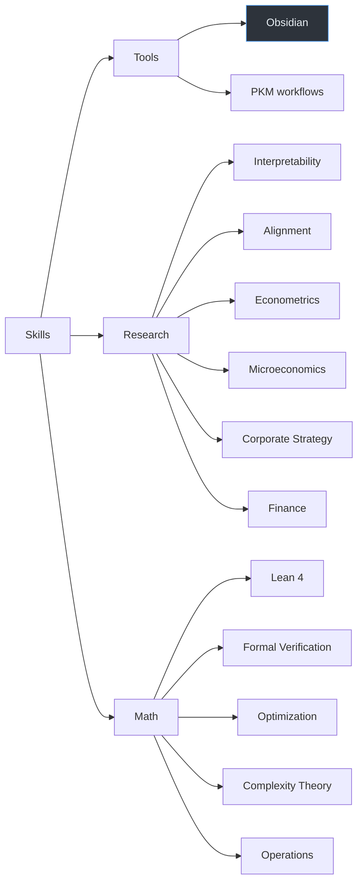

# Skills

Teaching AI agents the things I care about.

```
npx skills add thegovind/skills
```

## Installed

| Skill | What it does |
|-------|-------------|
| [obsidian](.github/skills/obsidian/) | CLI, Flavored Markdown, Bases databases, JSON Canvas |

## Roadmap



<details>
<summary>Skill structure</summary>

```
.github/skills/<name>/
├── SKILL.md              # YAML frontmatter + markdown body
└── references/           # Detailed docs, split by topic

tests/scenarios/<name>/
└── scenarios.yaml
```
</details>

MIT
